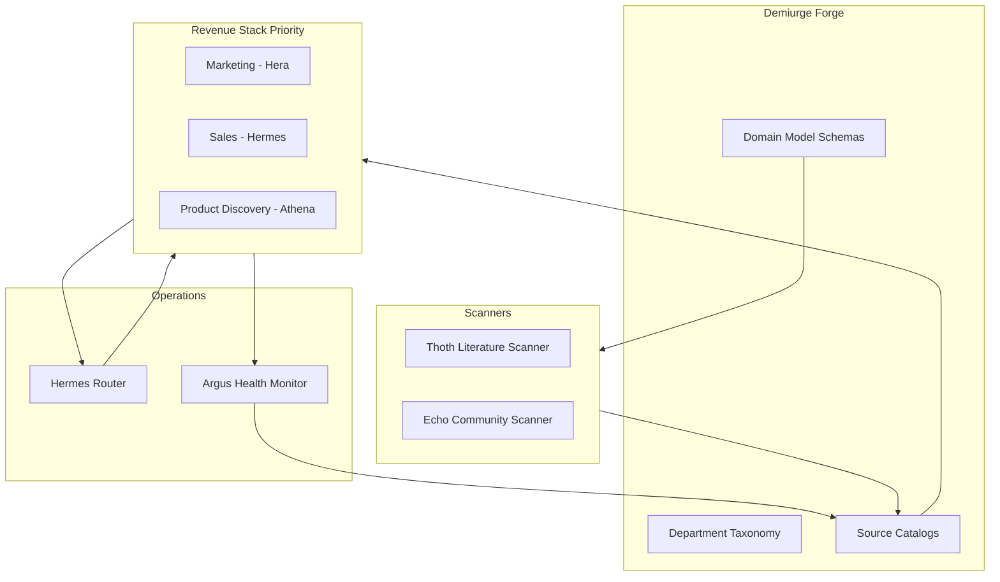

# DEMIURGE Architecture

> DEMIURGE-009

## System overview

DEMIURGE extends [agents-v2](../README.md) into a **self-designing, literature-grounded, named-agent swarm** that forges a 1000-person-equivalent org for any client company.



## Repository layout

```
agents-v2/
├── docs/demiurge/           # Architecture, schemas, reviews
├── tickets/DEMIURGE-NNN/    # Work tracking
├── sources/                 # Per-dept source catalogs
│   ├── marketing/
│   ├── sales/
│   └── product-discovery/
├── departments/             # Dept definitions + signal maps
│   ├── marketing/
│   ├── sales/
│   └── product-discovery/
├── demiurge/
│   ├── agents/              # Agent souls (PROMPT.md) + metadata
│   ├── router/              # Dispatch rules, timing, quorum
│   ├── feedback-loops/      # Loop definitions
│   └── kpi/                 # KPI schemas
├── agents-prompts/          # Legacy prompts (migrate to demiurge/agents)
├── patterns/                # Idempotency, hard-stops, SQLite
├── scripts/demiurge/        # Ticket generator, helpers
└── constitution/            # Org governance (existing)
```

## Runtime alignment (Hermes)

| DEMIURGE | Runtime path |
|----------|--------------|
| Agent git repo | `github.com/Ai-Whisperers/aiw-agent-<id>` |
| Operational DB | `/opt/data/db/<agent>.db` |
| Episodic memory | Agent git repo: outbox/, decisions/, lessons/ |
| Cron cadence | Hermes `jobs.json` via `hermes cron` |
| Router | Dedicated agent + `demiurge/router/` config |

## Build discipline

1. **Domain model first** — no department without schemas
2. **Sources ground roles** — literature before agents
3. **One version good → replicate** — from PLAN-v5
4. **Series between sprints** — human approval gates at 008, 015, 033, 041, 047
5. **Skeleton depts OK** — full inventory, activate in focused sessions

## Human gates

| Ticket | Gate |
|--------|------|
| DEMIURGE-008 | Domain model approval |
| DEMIURGE-015 | Sprint 1 approval |
| DEMIURGE-033 | Marketing activation |
| DEMIURGE-041 | Sales activation |
| DEMIURGE-047 | Product Discovery activation |

## Infrastructure blockers (existing)

- OpenRouter $20 topup — 14 cron jobs HTTP 402
- Cloudflare Workers Routes token — rubicon-eas routing
