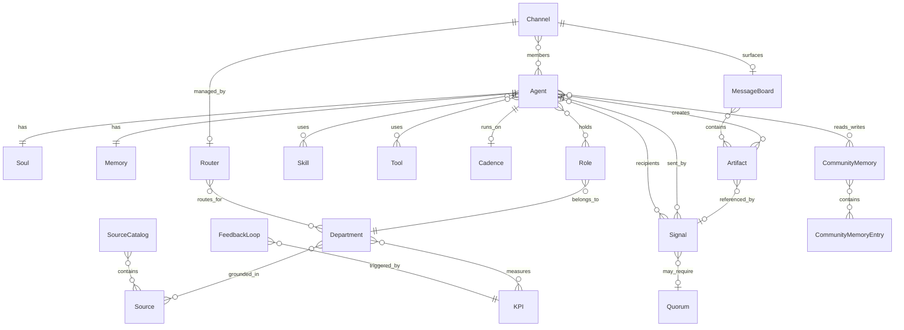

# DEMIURGE Domain Model

> Locked Sprint 0. Every agent, department, and signal is an instance of these objects.

## Object graph

## Hermes alignment

| DEMIURGE concept | Hermes / runtime concept |
|----------------|--------------------------|
| Soul | Immutable agent identity kernel (PROMPT.md + hard_stops YAML) |
| Memory Layer 2 Episodic | Git repo per agent: notes, findings, lessons, boards/ |
| Memory Layer 2.5 Community | Shared git repos: `aiw-community-*` — practices, norms, Echo signals |
| Memory Layer 3 Operational | SQLite: tasks, todos, escalations, idempotency |
| Cadence | Hermes cron job registration |
| Signal | Inter-agent message routed by Router |
| Router | Dedicated Hermes instance or cron workflow |

## Design principles

1. **Soul is not memory** — identity is versioned separately from operational state.
2. **Git-backed memory is operational** — episodic history, not the soul.
3. **Agents have names** — memorable names (e.g. Hera, Thoth) plus role IDs.
4. **Roles are fungible** — multiple agents per role; one agent across departments.
5. **Signals are typed** — direct, group, dept_broadcast, cross_dept.
6. **Router enforces delivery** — right agents, on time, quorum met.
7. **Sources ground departments** — literature + community, quality-rated 1–5.
8. **Feedback loops are first-class** — monitor → source → soul → agent.
9. **Artifacts are first-class** — notes, tasks, todos, boards, thoughts, findings, learnings; agents read/write them across memory layers.

## Schema files

See `schemas/` for field-level definitions and JSON Schema fragments.

| Schema | Objects |
|--------|---------|
| [artifacts.md](schemas/artifacts.md) | Artifact, MessageBoard, Task, Todo, Thought, Finding, Learning |
