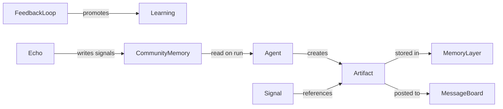

# Schema: Artifacts

> Extends DEMIURGE-002. Notes, tasks, boards, thoughts, findings, and related working objects.

## Why artifacts are first-class

A 1000-person company runs on **artifacts**, not just agent runs. Agents produce, consume, and react to artifacts. Signals carry pointers to artifacts; message boards surface them; tasks drive cadence.



## Artifact (base type)

```yaml
Artifact:
  id: string                # uuid or slug
  type: ArtifactType
  title: string
  body: string              # markdown
  author_id: string         # Agent or human:ivan
  owner_id: string          # accountable party
  department_id: string     # optional scope
  channel_id: string        # optional board/channel
  signal_id: string         # optional parent signal
  status: enum              # draft | open | in_progress | done | archived | superseded
  priority: enum            # low | normal | high | critical
  tags: string[]
  refs: ArtifactRef[]       # links to other artifacts, sources, KPIs
  visibility: enum          # private | dept | cross_dept | org
  created_at: iso8601
  updated_at: iso8601
  expires_at: iso8601       # optional for todos/tasks
```

```yaml
ArtifactRef:
  ref_type: enum            # artifact | source | signal | kpi | role | external_url
  ref_id: string
  label: string
```

## ArtifactType

| type | Purpose | Typical layer | Git path / SQLite |
|------|---------|---------------|-------------------|
| `note` | Quick capture, context, meeting scratch | Episodic | `notes/YYYY-MM-DD-<slug>.md` |
| `task` | Owned work item with outcome | Operational + Episodic snapshot | `tasks` table + `tasks/done/` |
| `todo` | Small actionable item, often agent-local | Operational | `todos` table |
| `message` | Single board/channel post | Episodic + Channel | `boards/<board-id>/messages/` |
| `thread` | Grouped messages on a board | Episodic | `boards/<board-id>/threads/<id>/` |
| `thought` | Hypothesis, raw reasoning, not yet validated | Episodic | `thoughts/` |
| `finding` | Validated observation from scan/research | Episodic | `findings/` |
| `learning` | Distilled lesson after action | Episodic | `lessons/` |
| `decision` | Recorded choice with rationale | Episodic | `decisions/` |
| `brief` | Structured output (campaign, pipeline, insight) | Episodic | `outbox/` or `briefs/` |
| `report` | Periodic summary (health, KPI, scan) | Episodic | `reports/` |
| `review` | Human or agent review comment | Episodic | `reviews/` |
| `escalation` | SLA breach or quorum failure record | Operational + Episodic | `escalations` table + `escalations/` |

### Promotion path (thought → learning)

```
thought → finding → learning → decision → soul revision proposal
```

Not every thought becomes a learning. Findings require evidence (`refs` to sources or signals). Learnings feed `FeedbackLoop` and optionally `Source` key_insights.

## MessageBoard

A durable surface for dept/group conversation. Maps to `Channel` with `type: group | dept`.

```yaml
MessageBoard:
  id: string
  name: string
  channel_id: string        # links to Channel
  department_id: string
  members: string[]         # agent ids + human ids
  router_id: string
  retention_days: int
  artifact_types_allowed: ArtifactType[]  # usually message, thread, note, task
  pins: string[]             # pinned artifact ids
```

### Board vs Signal

| Mechanism | Use when |
|-----------|----------|
| **Signal** | Time-bound, needs routing, quorum, SLA |
| **MessageBoard** | Ongoing thread, reference, async collaboration |

Signals can reference board artifacts: `payload.artifacts[]`.

## Task vs Todo

| | Task | Todo |
|---|------|------|
| Scope | Dept or cross-agent | Agent-local or sub-task |
| Owner | Required | Required |
| Due date | Common | Optional |
| Links to KPI | Often | Rare |
| Completion | Triggers feedback loop possible | Closes locally |

Both live in **Operational** (SQLite) while open; on `done`, snapshot commits to episodic git.

## Department artifact layout (git)

Per-agent repo, plus optional **dept board repo**:

```
aiw-agent-<id>/
├── notes/
├── thoughts/
├── findings/
├── lessons/          # learnings
├── decisions/
├── outbox/           # run briefs
├── briefs/
├── reports/
├── reviews/
├── boards/           # if agent hosts a board
│   └── revenue-stack/
│       ├── messages/
│       └── threads/
└── tasks/done/       # completed task snapshots
```

Dept-scoped board (optional shared repo):

```
aiw-dept-marketing/
└── boards/
    └── main/
        ├── messages/
        └── pinned.md
```

## SQLite tables (operational)

Extend Layer 3:

```yaml
tables:
  - tasks                 # id, title, status, owner, due, dept, artifact_body_ref
  - todos                 # id, title, status, owner, parent_task_id
  - board_index           # artifact_id, board_id, pinned, last_activity
  - escalations           # signal_id, rule_id, status, resolved_at
```

## Agent obligations

On each run, agents should:

1. Read open `tasks` / `todos` assigned to them
2. Check dept `MessageBoard` for unread `message` artifacts (via Router or board poller)
3. Write `finding` / `learning` when scan or action produces durable knowledge
4. Capture `thought` freely; promote to `finding` only with refs

## Validation checklist

- [ ] Every completed task snapshots to episodic git
- [ ] Findings cite ≥1 source or signal ref
- [ ] Board messages never contain credentials (OPSEC)
- [ ] Learnings link forward to decisions or feedback loops when acted on
