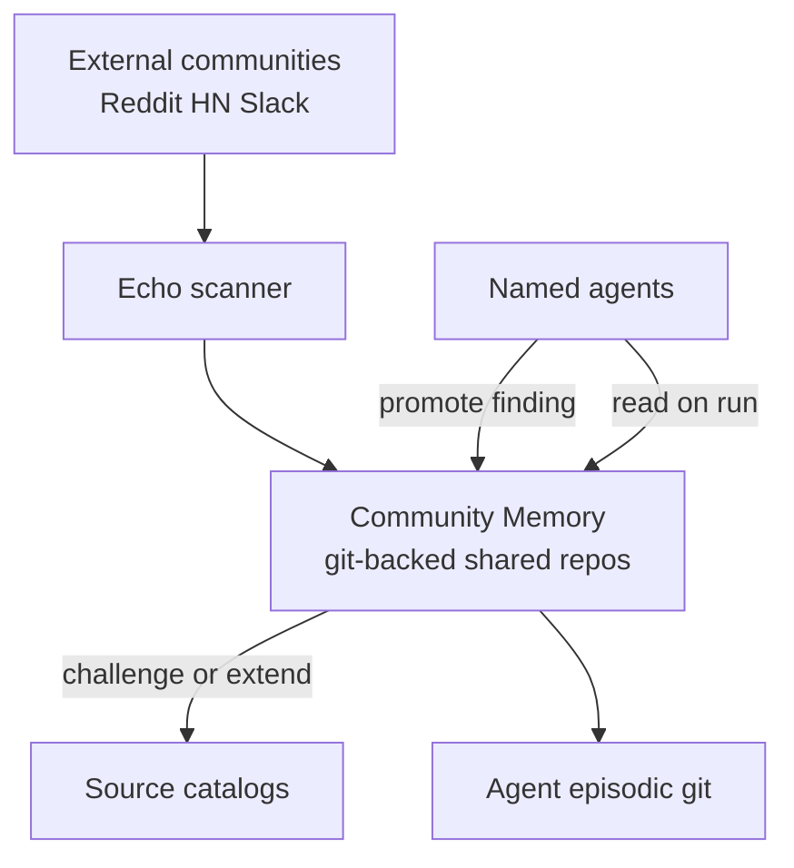

# Schema: Community Memory

> Shared memory across agents, departments, and practitioner communities. Distinct from per-agent episodic memory and from static source catalogs.

## Why community memory is separate

| Store | What it holds | Who writes | Update speed |
|-------|---------------|------------|--------------|
| **Source catalog** | Authoritative literature | Thoth (scanner) | Weeks |
| **Episodic memory** | This agent's runs, notes, lessons | Individual agent | Per run |
| **Community memory** | Collective practitioner knowledge, org norms, living practices | Echo + all agents + humans | Days |
| **Semantic memory** | Embedded RAG index | System (deferred) | Continuous |

Community memory is how a swarm **learns together** without merging agent identities.



## CommunityMemory (container)

```yaml
CommunityMemory:
  id: string                # e.g. cm-marketing, cm-org, cm-revenue-stack
  name: string
  scope: enum               # department | cross_dept | org | external_mirror
  scope_ids: string[]       # marketing, sales, product-discovery
  git_repo: string          # github.com/Ai-Whisperers/aiw-community-<scope>
  maintainer_agents: string[]  # echo-community-scanner, dept leads
  read_access: enum         # scope_members | org | public_readonly
  write_access: enum        # agents_in_scope | leads_only | human_approval
  last_consolidated: iso8601
  entry_count: int
```

### Standard community memory repos

| id | scope | repo | maintainer |
|----|-------|------|------------|
| `cm-org` | org | `aiw-community-org` | Echo, Argus |
| `cm-revenue-stack` | cross_dept | `aiw-community-revenue` | Hera, Apollo, Athena, Echo |
| `cm-marketing` | department | `aiw-community-marketing` | Hera, Echo |
| `cm-sales` | department | `aiw-community-sales` | Apollo, Echo |
| `cm-product-discovery` | department | `aiw-community-product-discovery` | Athena, Echo |

## CommunityMemoryEntry

```yaml
CommunityMemoryEntry:
  id: string
  type: CommunityEntryType
  title: string
  body: string              # markdown
  contributed_by: string    # agent:id or human:ivan
  source_refs: SourceRef[]  # url, community post, literature id
  departments: string[]
  tags: string[]
  confidence: float         # 0.0–1.0 aggregate
  corroborations: Corroboration[]
  contested_by: string[]    # agent/human ids disputing entry
  status: enum              # proposed | active | deprecated | contested | merged
  promoted_from: string     # artifact id (finding, learning) if promoted
  created_at: iso8601
  updated_at: iso8601
  last_validated: iso8601
  expires_at: iso8601       # optional TTL for fast-moving tactics
```

```yaml
Corroboration:
  by: string                # agent or human id
  at: iso8601
  note: string              # optional
  weight: float             # lead agents weight higher
```

## CommunityEntryType

| type | Example |
|------|---------|
| `practice` | "Founder-led LinkedIn posts outperform ads for SMB coaching ICP" |
| `anti_pattern` | "Cold outbound without consent burns Paraguay SMB trust" |
| `language` | "ICP says 'acompañamiento' not 'coaching' in ES market" |
| `tool_tip` | "Listmonk + Plausible beats Mailchimp for our scale" |
| `ritual` | "Win/loss review every Friday → pipeline feedback signal" |
| `signal` | Raw community pulse (from Echo, short TTL) |
| `insight` | Synthesized from multiple signals |
| `norm` | Org behavior rule (e.g. inbound-first per D2) |

## Git layout

```
aiw-community-revenue/
├── README.md
├── INDEX.md               # searchable index by tag/type/dept
├── practices/
├── anti-patterns/
├── language/
├── tool-tips/
├── rituals/
├── signals/               # YYYY-MM-DD-echo-scan.md
├── insights/
├── norms/
├── contested/               # entries under dispute
└── archive/                 # deprecated entries with reason
```

## Write paths

| Writer | What | Gate |
|--------|------|------|
| **Echo** | `signal` entries from external scan | Auto |
| **Any agent** | `practice` proposal from personal `finding` | Dept lead ack or 2 corroborations |
| **Dept lead** | `norm`, `ritual`, promote to `active` | Auto within dept scope |
| **Human** | Override, deprecate, resolve contested | Ivan/Kiki |
| **Argus** | Deprecate stale entries (past `expires_at`) | Auto + log |

## Read contract (agents)

On each run, revenue-stack agents read:

1. `cm-revenue-stack` entries tagged for their dept (last 30 days active)
2. Dept-specific `cm-<dept>` for deep context
3. `cm-org` norms (always)

Personal episodic memory is **not** a substitute — agents cite community entry ids in findings and signals.

## Promotion and demotion

```
Echo signal → community insight → (corroboration) → active practice
                                    ↓
                         personal finding → learning (episodic)
                                    ↓
                         Thoth updates source catalog (if literature-backed)
```

Demotion: `contested` → review by dept leads → `deprecated` or restored.

## Relation to MessageBoard

- **MessageBoard** = conversation surface (messages, threads)
- **Community memory** = distilled, durable knowledge extracted from boards, scans, and runs

Board threads can be **promoted** to community entries via dept lead or quorum.

## Relation to Semantic layer (Tier 2)

When Qdrant activates, community memory entries are a **primary ingestion source** alongside source catalogs and episodic learnings.

## Validation checklist

- [ ] Every `active` entry has ≥1 source_ref or ≥2 corroborations
- [ ] `signal` entries expire or merge within 30 days
- [ ] Contested entries never drive hard_stops or soul changes without human review
- [ ] No credentials or PII in community memory bodies
