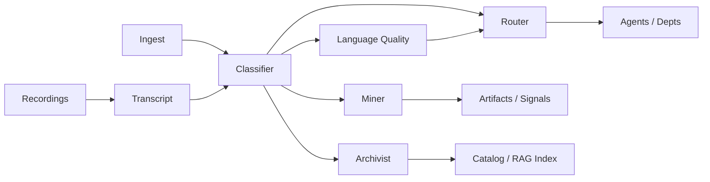

# Schema: Document

> DEMIURGE-078. Document envelope, classification attributes, and routing metadata for the Document Intelligence System.

## Why documents need a schema

Every document entering or created within the org carries implicit attributes: who it is for, how urgent it is, what type it is, what it contains, and where it goes. Without a classification layer, agents receive everything and filter nothing. With it, each agent only sees what is relevant.

This schema defines the **document envelope** — the wrapper around raw content that carries identity, given attributes (from the creator), and derived attributes (from the Classifier). It extends the artifact model in [`artifacts.md`](artifacts.md); a classified document may also produce or reference artifacts (decisions, action items, findings).



## DocumentEnvelope

```yaml
DocumentEnvelope:
  id: string                   # uuid
  schema_version: string       # e.g. "1.0" — versioned from day one
  dc_type: string              # Dublin Core type (see mapping below)
  document_type: string        # system type (see extending document types)
  title: string
  body: string                 # markdown or plain text; binary refs via storage_uri
  author_id: string            # agent-id or human:ivan
  source_id: string            # provenance (W3C PROV-O inspired)
  storage_uri: string          # optional path or URL for original file (recording, PDF)
  artifact_id: string          # optional link to Artifact in artifacts.md
  created_at: iso8601
  ingested_at: iso8601

  given:
    audience: string[]         # agent-id | dept-id | role | broadcast | human-only
    urgency: string            # P0 | P1 | P2 | P3 | unknown

  derived:
    urgency: string              # P0 | P1 | P2 | P3 — ITIL aligned
    urgency_confidence: float    # 0.0–1.0
    audience: string[]
    audience_confidence: float
    formality: string            # formal | semi-formal | informal
    tone: string                 # directive | advisory | informational | confirmatory
    routing_tags: string[]
    has_action_items: bool
    has_decisions: bool
    has_nuggets: bool
    requires_human: bool
    # Themis (classifier) — content flags
    language_quality_score: float       # 0.0–1.0; set by peitho-language-quality
    terminology_compliance_score: float # 0.0–1.0; set by peitho-language-quality
    classifier_model: string            # set by themis-document-classifier
    classifier_run_id: string
    classified_at: iso8601
```

## Given vs derived attributes

| Kind | Set by | When empty | Authority |
|------|--------|------------|-----------|
| **Given** | Creator at ingest or author time | Classifier must infer | Creator intent; may be wrong or incomplete |
| **Derived** | Document Classifier (LLM structured extraction) | N/A after classification run | System inference; always carries confidence |

Rules:

1. **Given wins for routing hints** when present and confidence is high — e.g. explicit `given.audience` is honored unless Classifier flags conflict.
2. **Derived fills gaps** — when `given.urgency` is `unknown`, Classifier sets `derived.urgency` from content.
3. **Urgency ambiguity** — content may require full read before urgency is knowable; Classifier may emit `derived.urgency` with low `urgency_confidence` and Router may hold in queue until confidence threshold met or human ack.
4. Vocabulary for `document_type`, `formality`, `tone`, `routing_tags` is authoritative in `docs/terminology/TERMS.md` (DEMIURGE-077). This schema references terms by name; do not redefine locally.

### Dispatch match convention

`derived.audience` is a `string[]` on the envelope. Dispatch rules in `document-dispatch-rules.yaml` match on `routing_tags` — the Classifier must copy each audience value (dept-id, agent-id, role) into `routing_tags` for routing to work. Do not use a separate scalar `derived_audience` field in dispatch config.

### Routing pipeline

1. Themis emits `document-classified` → Mnemosyne, Hephaestus, Peitho (parallel)
2. Peitho always emits `quality-assessed` when assessment completes
3. Pheme routes only on `quality-assessed` (never on `document-classified` directly)
4. Formal external communications with `gate_triggered: true` block Pheme until author ack clears the gate

## Dublin Core mapping

`dc_type` uses [Dublin Core](https://www.dublincore.org/specifications/dublin-core/dcmi-terms/) type vocabulary where applicable. `document_type` is the org-specific refinement.

| document_type | dc_type | Notes |
|---------------|---------|-------|
| plan | Text | Project plans, ticket plans |
| report | Text | Periodic or ad-hoc reports |
| signal | Text | May also map to Signal in signal-channel.md |
| transcript | Text | Speech-to-text output |
| research | Text | Synthesis, literature review |
| spec | Text | Technical specifications |
| communication | Text | Email, memo, chat export |
| recording | Sound | Original audio/video; body often empty until transcribed |

Additional Dublin Core fields may be promoted to envelope top-level in future schema versions (`dc:subject`, `dc:language`). Phase 1 keeps identity minimal.

## Extending document types

- `document_type` and `routing_tags` are **documented strings**, not closed enums — new values are added to DEMIURGE-077 `TERMS.md` first, then used here.
- `schema_version` increments when breaking changes occur; Classifier and Archivist must declare supported versions.
- Binary formats (PDF, DOCX) ingest via `storage_uri`; text extraction is a preprocessing step before classification.

## Mined assets (outputs of Document Miner)

Miner produces structured records linked to `DocumentEnvelope.id`:

```yaml
ActionItem:
  id: string
  document_id: string
  text: string
  owner_hint: string         # optional agent-id or role
  due_hint: string           # optional iso8601 or relative phrase
  confidence: float

Decision:
  id: string
  document_id: string
  summary: string
  rationale: string
  daci:                      # DACI-inspired roles where inferable
    driver: string
    approver: string
    contributor: string
    informed: string
  confidence: float

Nugget:
  id: string
  document_id: string
  excerpt: string
  topic_tags: string[]
  intentional: bool          # true if likely placed deliberately
  confidence: float
```

## Prior art references

| Concern | Standard / tool | Use in this system |
|---------|-----------------|-------------------|
| Document identity | Dublin Core | `dc_type`, envelope identity fields |
| Provenance | W3C PROV-O | `source_id`, lineage to parent recording/transcript |
| Urgency | ITIL P0–P3 | `given.urgency`, `derived.urgency` |
| Classification | LLM structured extraction | Classifier agent |
| Terminology | SKOS (W3C) | `terminology_compliance_score` vs DEMIURGE-077 TERMS |
| Readability | Flesch-Kincaid | `language_quality_score` normalization |
| Catalog / retrieval | RAG dual-index (BM25 + vector) | Archivist Phase 3 target |

## Dependency on DEMIURGE-077

The Classifier and Language Quality agents require an authoritative vocabulary (`docs/terminology/TERMS.md`). Until 077 is complete, classification uses provisional term lists documented in ticket DEMIURGE-077 context. Miner flags new terminology for 077 registry when terms appear in documents but are not in TERMS.

## Validation checklist

- [ ] Every ingested document has `id`, `schema_version`, `ingested_at`
- [ ] Derived attributes include confidence where produced by Classifier
- [ ] `document_type` values used in production are defined in TERMS.md
- [ ] Recordings link `storage_uri` to transcript envelope via `source_id` / PROV lineage
- [ ] Mined action items and decisions cite `document_id`
