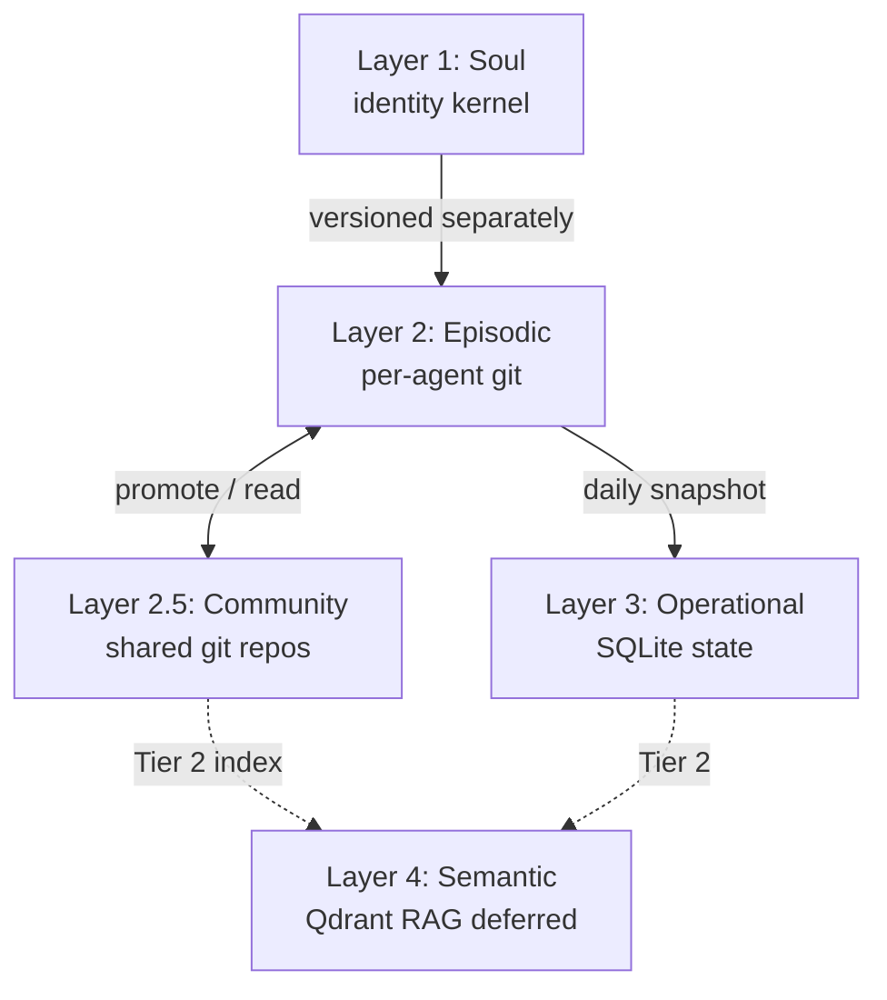

# Schema: Memory Layers

> DEMIURGE-002

## Overview

Memory is layered. **Git-backed storage is operational (episodic), not the soul.**



## Memory

```yaml
Memory:
  agent_id: string
  layers:
    soul: SoulRef           # pointer only; soul lives in PROMPT.md + schema
    episodic: EpisodicMemory
    community: CommunityMemoryRef[]  # shared repos this agent reads/writes
    operational: OperationalMemory
    semantic: SemanticMemory  # optional, Tier 2
```

```yaml
CommunityMemoryRef:
  community_memory_id: string   # e.g. cm-revenue-stack
  git_repo: string
  read: boolean
  write: boolean                # false for most sub-agents
```

See [community-memory.md](community-memory.md) for full schema.

## Layer 1 — Soul (reference only)

Not stored in Memory object. See [agent-soul.md](agent-soul.md).

- Immutable identity kernel
- Versioned via Soul.version semver
- Changes require explicit soul revision ticket

## Layer 2 — Episodic

What happened. Git-backed, committed history.

```yaml
EpisodicMemory:
  git_repo: string
  paths:
    outbox: string          # outbox/YYYY-MM-DD.md — run briefs
    briefs: string          # briefs/ — structured outputs
    notes: string           # notes/ — quick capture
    thoughts: string        # thoughts/ — hypotheses, raw reasoning
    findings: string        # findings/ — validated observations
    lessons: string         # lessons/ — learnings (distilled)
    decisions: string       # decisions/
    reports: string         # reports/ — periodic summaries
    reviews: string         # reviews/ — review comments
    eval: string            # eval/
    boards: string          # boards/<board-id>/messages|threads/
    tasks_done: string      # tasks/done/ — completed task snapshots
    memories: string        # memories/ — legacy free-form
  retention_days: int       # default 365
  auto_commit: boolean      # state-auto-commit cron
  last_commit: iso8601
```

### Episodic write rules

- Atomic writes (temp + mv)
- One outbox file per run per day
- decisions/ and lessons/ are append-by-commit, never force-pushed

## Layer 2.5 — Community

What **we** know collectively. Git-backed **shared** repos (not per-agent). Fed by Echo, promoted findings, dept leads, humans.

- Scope: department, cross_dept (revenue stack), or org
- Distinct from Source catalog (literature) and from personal episodic memory
- Agents **read** on every run; **write** via promotion rules or Echo

Full schema: [community-memory.md](community-memory.md).

## Layer 3 — Operational

Current state. SQLite per agent.

```yaml
OperationalMemory:
  db_path: string           # /opt/data/db/<agent>.db
  schema_version: int
  tables:
    - idempotency           # last_run keys
    - state_snapshots       # point-in-time JSON blobs
    - tasks                 # open work items (see artifacts.md)
    - todos                 # agent-local small actions
    - board_index           # board activity index
    - escalations           # SLA/quorum failures
    - entity_specific       # leads, outreach_log, etc.
  backup:
    daily_snapshot: boolean
  last_validated: iso8601
```

Aligns with [patterns/sqlite-schema.md](../../../patterns/sqlite-schema.md).

## Layer 4 — Semantic (deferred)

What I know. Cross-agent RAG.

```yaml
SemanticMemory:
  backend: enum             # qdrant | deferred
  collection: string
  embed_model: string
  trigger: string           # e.g. source_materials > 50 files
  status: enum              # deferred | active
```

Promotion trigger: source catalog > 50 entries OR eval-gate needs golden trajectories.

## Migration from JSON state

Existing `/opt/data/agents/state/*.json` → SQLite via `migrate_state_to_sqlite.py`. JSON kept read-only mirror 30 days per PLAN-v5 Phase 5.5.

## Validation checklist

- [ ] Episodic git repo exists and pushes daily
- [ ] Community memory repos exist for active dept scopes
- [ ] Agents declare CommunityMemoryRef in agent.yaml
- [ ] Operational DB passes schema validate every 15 min
- [ ] Soul layer never written to SQLite or episodic git as overwrite
- [ ] Semantic layer documented as deferred unless trigger met
