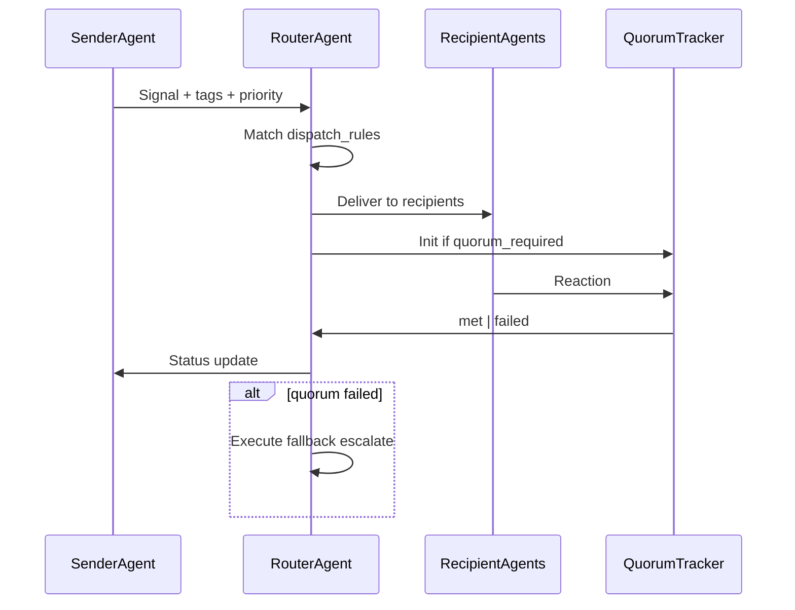

# Schema: Router + Quorum

> DEMIURGE-005

## Router

Specialized agent that dispatches signals, enforces timing, and tracks quorum. Mimics internal routing / ops desk of a large company.

```yaml
Router:
  id: string                # e.g. hermes-router-revenue
  name: string              # "Hermes" (messenger god)
  agent_id: string          # underlying Agent
  routes_for: string[]      # Department or Channel ids
  dispatch_rules: DispatchRule[]
  timing_rules: TimingRule[]
  quorum_tracker: QuorumTracker
  status: enum              # active | paused
```

## DispatchRule

Who sees what, based on signal type and tags.

```yaml
DispatchRule:
  id: string
  match:
    signal_type: enum       # direct | group | dept_broadcast | cross_dept
    routing_tags: string[]  # all must match (AND)
    priority_min: enum      # optional floor
  deliver_to:
    - type: enum            # agent | department | channel
      id: string
  fan_out: enum             # all | first_available | round_robin
```

## TimingRule

SLA enforcement per signal type or tag.

```yaml
TimingRule:
  id: string
  match:
    routing_tags: string[]
    department_id: string
  sla_reaction: duration    # ISO 8601, e.g. PT2H
  escalate_to: string       # agent id or human:ivan
  escalate_after: duration
  off_hours_multiplier: float  # e.g. 2.0 for longer SLA off-hours
```

### Example timing rules (revenue stack)

| Rule | SLA | Escalate to |
|------|-----|-------------|
| inbound-lead | PT2H | sales lead agent |
| content-ready | PT4H | sales lead agent |
| pipeline-feedback | PT24H | marketing lead |
| product-insight | PT48H | product discovery lead |

## Quorum

Reaction criteria before a signal is considered handled.

```yaml
Quorum:
  id: string
  name: string
  required_count: int       # minimum reactions
  required_agents: string[] # specific agents that MUST react (optional)
  time_window: duration     # e.g. PT4H
  fallback: enum            # escalate | auto_resolve | alert | expire
  fallback_target: string   # agent or human id
  on_met: enum              # close_signal | trigger_next_workflow
```

### Quorum examples

| Scenario | required_count | required_agents | fallback |
|----------|----------------|-----------------|----------|
| Content publish approval | 2 | marketing-lead, sales-lead | escalate to ivan |
| Lead qualification | 1 | sales-lead | alert |
| Cross-dept campaign brief | 3 | any from mkt+sales+pd | auto_resolve + log |

## QuorumTracker

Runtime state (operational memory, SQLite).

```yaml
QuorumTracker:
  signal_id: string
  quorum_id: string
  reactions: Reaction[]
  met_at: iso8601
  status: enum              # open | met | failed | escalated
```

## Router operational flow



## Test cases

See [router-test-cases.md](../router-test-cases.md) (DEMIURGE-052).
