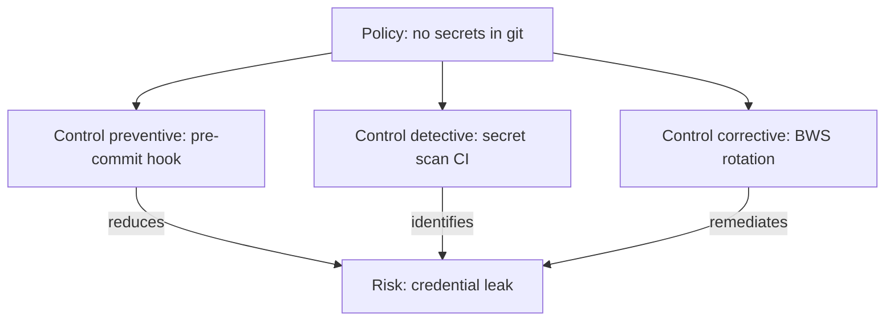

# Governance Entities

> **Domain:** 6 — Governance
> **Status:** `proposed`
> **Terms:** [policy](../../terminology/TERMS.md), [risk](../../terminology/TERMS.md), [control](../../terminology/TERMS.md)

Entities describing goals, rules, risks, controls, and accountability structures.

---

## Entity definitions

### Goal

An organizational objective with measurable target and timeframe — strategic or tactical. OKR-aligned.

```yaml
Goal:
  entity_type: Goal
  goal_type: strategic | tactical | operational
  target_metric: string | null
  target_value: string | null
  due_at: iso8601 | null
  owner_id: string
```

### Requirement

A condition or capability the system or organization must satisfy — functional, non-functional, regulatory.

**Distinct from:** Policy (organizational rule); Requirement is what must be true.

```yaml
Requirement:
  entity_type: Requirement
  requirement_type: functional | non_functional | regulatory | security
  priority: must | should | may
  verification_method: string
  source_ref: string | null
```

### Principle

A guiding belief or design constraint — informs decisions but is not directly enforceable.

**Distinct from:** Policy (mandatory rule); Standard (normative specification).

```yaml
Principle:
  entity_type: Principle
  statement: string
  rationale: string
  adr_refs: string[]
```

### Policy

A mandatory organizational rule — what must or must not be done. Has owner, scope, and effective dates.

```yaml
Policy:
  entity_type: Policy
  scope: string
  effective_from: iso8601
  effective_until: iso8601 | null
  standard_ids: string[]
  control_ids: string[]
```

### Standard

A normative specification defining how something must be done — coding, documentation, security baselines.

```yaml
Standard:
  entity_type: Standard
  standard_type: internal | iso | industry | regulatory
  external_ref: string | null
  policy_ids: string[]
```

### Risk

Uncertain event or condition affecting objectives. Has likelihood, impact, owner, and treatment.

```yaml
Risk:
  entity_type: Risk
  description: string
  likelihood: low | medium | high
  impact: low | medium | high
  treatment: accept | mitigate | transfer | avoid
  owner_id: string
  control_ids: string[]
```

### Control

Safeguard enforcing policy, detecting deviation, or correcting after failure.

#### Control types

| Type | Purpose | Example |
|------|---------|---------|
| **Preventive** | Stops harm **before** it occurs | Pre-commit hook blocking secrets |
| **Detective** | Identifies deviation **after** occurrence | Audit log review, eval gate |
| **Corrective** | **Remediates** after detection | Rollback script, credential rotation |

```yaml
Control:
  entity_type: Control
  control_type: preventive | detective | corrective
  policy_id: string
  frequency: continuous | daily | weekly | on_event | ad_hoc
  owner_id: string
  evidence_expectation: string
  automation_ref: string | null
```

### Obligation

External requirement imposed by law, contract, or regulation — distinct from internal policy.

```yaml
Obligation:
  entity_type: Obligation
  source: legal | contractual | regulatory
  source_ref: string
  due_cadence: iso8601_duration | null
  control_ids: string[]
```

### Classification

A label scheme for sensitivity, handling, and access — data, document, or system classification.

```yaml
Classification:
  entity_type: Classification
  level: public | internal | confidential | restricted
  handling_rules: string[]
  applies_to_types: string[]
```

### KPI

Key performance indicator — governed measure with owner, target, and review cadence.

**Canonical schema:** [feedback-kpi-cadence.md](../../demiurge/schemas/feedback-kpi-cadence.md)

```yaml
KPI:
  entity_type: KPI
  metric_id: string | null
  target_value: string
  review_cadence: iso8601_duration
  owner_role_id: string
  department_id: string | null
```

### SLO

Service level objective — reliability or performance target for a system or service.

```yaml
SLO:
  entity_type: SLO
  system_id: string | null
  service_id: string | null
  metric: string
  target: string
  measurement_window: iso8601_duration
```

### Owner

Accountability role for an entity — RACI "Accountable" or "Responsible" party. May reference human or role.

```yaml
Owner:
  entity_type: Owner
  owner_type: human | role | agent
  owner_ref: string
  accountability_scope: string
```

### Steward

Custodian responsible for quality, access, and lifecycle of information assets — DAMA-aligned.

**Distinct from:** Owner (accountable for outcomes); Steward (custodian for data/knowledge quality).

```yaml
Steward:
  entity_type: Steward
  steward_type: data | knowledge | process | technology
  domain_ids: string[]
  steward_ref: string
```

---

## Control chain example



---

## AIW instances (v0.1)

| Entity | Instance status | Notes |
|--------|-----------------|-------|
| Policy | partial | AGENTS.md safety red lines, zero-warnings policy |
| Principle | partial | ADRs, engineering principles in AGENTS.md |
| Standard | partial | Rules framework, commit conventions |
| Control | partial | Pre-commit, eval gate, BWS wrapper |
| KPI | partial | Dept KPIs in schema; not all active |
| Owner | yes | governance.owner_id on entities |
| Goal, Requirement, Risk, Obligation, SLO, Steward | no/partial | Informal or not catalogued |

---

## Related documents

- [GOVERNANCE.md](../GOVERNANCE.md) — Framework lifecycle
- [APPROVALS.md](../APPROVALS.md) — Review gates
- [value-market.md](value-market.md) — Contract
- [feedback-kpi-cadence.md](../../demiurge/schemas/feedback-kpi-cadence.md) — KPI schema
