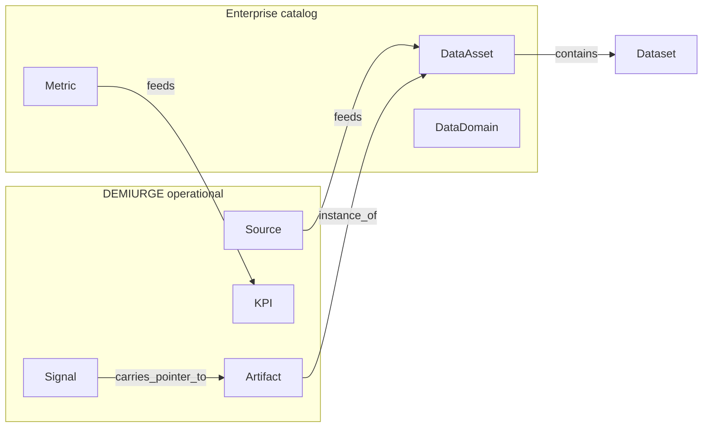

# Information and Data Entities

> **Domain:** 4 — Information and data
> **Status:** `proposed`
> **Terms:** [data asset](../../terminology/TERMS.md), [artifact](../../terminology/TERMS.md), [signal](../../terminology/TERMS.md), [source](../../terminology/TERMS.md)

Entities describing governed information, data structures, and how AIW produces, stores, and routes knowledge.

---

## Existing DEMIURGE mapping

The following entities are **already defined** in DEMIURGE. This catalog references them — it does not duplicate their schemas.

| Catalog entity | Canonical schema | TERMS entry | Notes |
|----------------|------------------|-------------|-------|
| **Artifact** | [artifacts.md](../../demiurge/schemas/artifacts.md) | `artifact` | Durable agent-produced objects (note, task, finding, etc.) |
| **Source** | [source-catalog.md](../../demiurge/schemas/source-catalog.md) | `source`, `source catalog` | External feed catalog entries |
| **Signal** | [signal-channel.md](../../demiurge/schemas/signal-channel.md) | `signal`, `signal type` | Routed time-bound messages |
| **Document** | [document.md](../../demiurge/schemas/document.md) | *(planned v1.1)* | Structured document envelope |
| **KPI** | [feedback-kpi-cadence.md](../../demiurge/schemas/feedback-kpi-cadence.md) | operational section | Performance measures |
| **Channel** | [signal-channel.md](../../demiurge/schemas/signal-channel.md) | `channel` | Delivery path for signals |

**Rule:** When modeling information flows, use DEMIURGE schemas for Artifact, Source, Signal, and KPI. Use this catalog for data-governance abstractions (DataAsset, DataDomain) not yet in DEMIURGE.

---

## New entity definitions

### InformationDomain

A logical grouping of related information topics — business vocabulary boundary. Example: "Customer intelligence", "Agent operations".

**Distinct from:** DataDomain (physical/logical data grouping); Department (org unit).

```yaml
InformationDomain:
  entity_type: InformationDomain
  scope_description: string
  steward_id: string
  data_domain_ids: string[]
```

### DataDomain

A governed boundary for data assets sharing ownership, classification, and quality rules. DAMA-aligned.

```yaml
DataDomain:
  entity_type: DataDomain
  information_domain_id: string | null
  classification_default: string
  steward_id: string
  data_asset_ids: string[]
```

### DataAsset

A governed information resource with defined ownership, classification, quality expectations, and lifecycle.

```yaml
DataAsset:
  entity_type: DataAsset
  data_domain_id: string
  classification: public | internal | confidential | restricted
  quality_criteria: string[]
  dataset_ids: string[]
  steward_id: string
```

### Dataset

A bounded collection of records within a data asset — table, file set, or repository slice.

```yaml
Dataset:
  entity_type: Dataset
  data_asset_id: string
  format: string
  refresh_cadence: iso8601_duration | null
  record_type_id: string
```

### RecordType

A schema defining the structure of records in a dataset — fields, constraints, relationships.

```yaml
RecordType:
  entity_type: RecordType
  dataset_id: string
  data_element_ids: string[]
  primary_key: string
```

### DataElement

An atomic unit of data with definition, type, and business meaning — column, field, or attribute.

```yaml
DataElement:
  entity_type: DataElement
  name: string
  data_type: string
  definition: string
  classification: string | null
  record_type_id: string
```

### Document

Structured content with envelope metadata — author, version, visibility. Maps to DEMIURGE DocumentEnvelope when operational.

**Canonical schema:** [document.md](../../demiurge/schemas/document.md)

```yaml
Document:
  entity_type: Document
  document_type: spec | plan | adr | report | other
  envelope_ref: string
  artifact_id: string | null
```

### Metric

A measured value derived from data or events — may feed KPIs. Distinct from KPI (governed performance target with owner and cadence).

```yaml
Metric:
  entity_type: Metric
  formula: string | null
  data_source_refs: string[]
  unit: string
  kpi_id: string | null
```

### Event (information domain)

A data or system occurrence captured for routing, audit, or analytics. Overlaps with work-domain Event; classify by primary use:

- **Work Event** — triggers process or workflow ([work.md](work.md))
- **Information Event** — recorded for audit, streaming, or metric derivation (this section)

```yaml
Event:
  entity_type: Event
  event_type: string
  occurred_at: iso8601
  payload_schema_ref: string | null
  retention_policy_ref: string | null
```

---

## Cross-domain reference diagram



---

## AIW instances (v0.1)

| Entity | Instance status | Notes |
|--------|-----------------|-------|
| Artifact, Source, Signal, Channel | yes | Full DEMIURGE operational model |
| Document | partial | DocumentEnvelope schema exists |
| KPI | partial | Schema defined; not all depts have KPIs |
| DataAsset, DataDomain, Dataset | partial | Git repos, SQLite, BWS as implicit assets |
| InformationDomain, RecordType, DataElement | no | Not formally catalogued |

---

## Related documents

- [artifacts.md](../../demiurge/schemas/artifacts.md)
- [source-catalog.md](../../demiurge/schemas/source-catalog.md)
- [signal-channel.md](../../demiurge/schemas/signal-channel.md)
- [technology.md](technology.md) — DataStore
