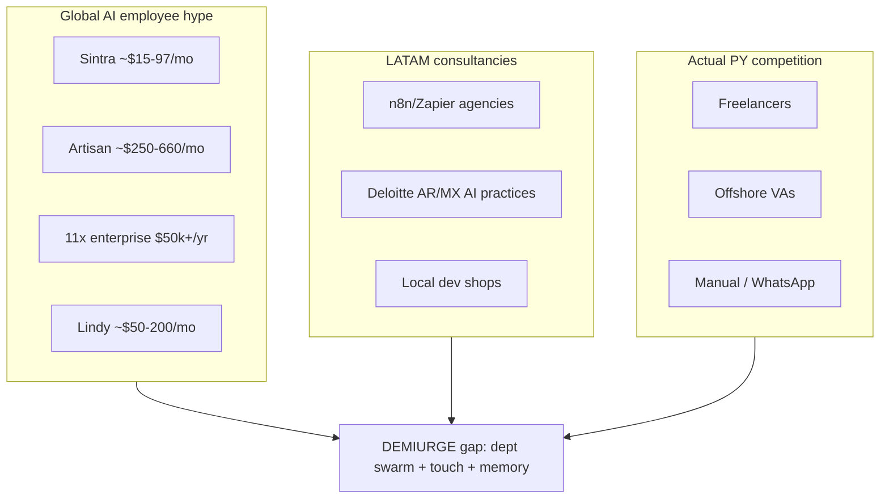

# Competitive Landscape — LATAM AI Ops & Consulting

> **Tickets**: DEMIURGE-061, DEMIURGE-062  
> **Status**: researched 2026-08-26  
> **Confidence**: medium-high on global products; medium on LATAM-native (fragmented market)

## Executive summary

**Real competition for PY SMBs is not Sintra/11x** — it's freelancers, VAs, and doing nothing. Global "AI employee" products sell hype at SaaS price points without departmental depth or personal touch. **Gap**: structured evolving departmental swarm with human gates, Spanish-native delivery, production ops — not agent soup.

---

## Category map

---

## Global "AI employee" products (sold into LATAM via YouTube/ads)

| Competitor | Price (public) | Positioning | Personal touch | Memory / depth | LATAM fit |
|------------|----------------|-------------|----------------|----------------|-----------|
| **Sintra** | $15.60–$97/mo (sale); 250 credits/mo cap | 12 "helpers" bundle | None — chat bots | Shallow; credit-limited | Low — English-first, no local support |
| **Artisan (Ava)** | Free tier; $250–$600/mo | AI BDR outbound | None | Sales-only | Low for PY SMB; US sales motion |
| **11x (Alice/Jordan)** | Contact sales; ~$50k–$90k/yr reported | Enterprise AI SDR | Sales-managed | Sales-only | None for SMB |
| **Lindy** | ~$50–$200/mo | General automation agents | Low | Workflow-level | Medium — technical buyers |
| **Beam** | $50/mo – $3,990/mo | Enterprise agents | Low | Dept templates | Low |
| **Relevance AI / CrewAI cloud** | Varies | Builder platforms | None | DIY | Medium — dev agencies resell |

### Hype product weaknesses (our positioning ammo)

1. **Credit caps** — Sintra stops when credits run out
2. **No departmental structure** — marketing ≠ sales ≠ finance in one chat
3. **No human gates** — proposals/outreach unreviewed
4. **No git-backed memory** — resets; no org learning
5. **English-first GTM** — no PY relationship motion
6. **Demo ≠ production** — no deploy monitoring, no runway brief

---

## LATAM-native AI consultancies

Fragmented. No dominant "AI ops for SMB" brand in PY.

| Type | Examples | Price band | Notes |
|------|----------|------------|-------|
| **n8n/Zapier agencies** | Local freelancers on Workana, Fiverr LATAM | $500–5k project | One-shot; no ongoing dept |
| **CrewAI partners** | Scattered; mostly BR/MX dev community | Project-based | Technical; no business ops framing |
| **Big 4 / regional consultancies** | Deloitte, PwC AI practices (AR, BR, MX) | $50k+ | Wrong buyer size |
| **Telefónica / Wayra portfolio** | Startups in BR, MX, AR, CL, CO, PE | VC-backed B2B | Not SMB ops consulting |
| **Sebrae / local SEBRAE equivalents** | Training + digitization programs | Subsidized/free | Education not deployment |
| **Marketing agencies + "AI"** | Local social media agencies adding ChatGPT | $200–800/mo | Content only; no ops |

[NEEDS VERIFY] Named PY agencies — scan MITIC partner list, LinkedIn "automatización Paraguay".

---

## Local alternatives (real competition)

| Alternative | Price | Why buyer chooses | Our counter |
|-------------|-------|-------------------|-------------|
| **Filipino VA** | $5–15/hr | Cheap labor | AI leverage + Spanish + timezone + systems |
| **Family / estudiante** | Free–low | Trust | Reliability, production SLA |
| **Manual WhatsApp** | $0 | Known | Burnout cost; lost leads |
| **Offshore dev (AR/CO)** | $20–50/hr | Technical | Full stack ops not just code |

---

## Coaching platforms (LATAM presence)

| Platform | LATAM presence | Price | Overlap |
|----------|----------------|-------|---------|
| **BetterUp** | Enterprise LATAM accounts | $$$$ | None — enterprise HR |
| **CoachHub** | EU-focused; some LATAM | $$$ | None — enterprise |
| **Local coaches** | PY WhatsApp networks | $50–500/mo | **Direct** — we enable their scale |

**Position**: We don't replace coaches; we remove mechanical ops so they keep personal touch.

---

## Framework resellers

| Framework | LATAM activity | Threat level |
|-----------|----------------|--------------|
| **n8n** | High — self-serve + agencies | Medium — we use it, differentiate on dept model |
| **Zapier** | Medium — expensive at scale | Low |
| **CrewAI** | Growing in BR/MX dev Twitter | Medium — technical buyers only |
| **Make (Integromat)** | Medium | Low |
| **LangChain/LangGraph** | Dev community | Low for SMB |

---

## Competitive positioning matrix

| Dimension | YouTube swarm | Anti-AI skeptic | **DEMIURGE** |
|-----------|---------------|-----------------|--------------|
| Structure | Agent soup | Manual only | Named dept agents |
| Evolution | Static prompts | N/A | Feedback loops + community memory |
| Personal touch | None | Full human | Human gates on critical actions |
| Memory | Session/credits | Tribal | Git-backed operational memory |
| Price | $15–600/mo SaaS | VA hourly | $240–1,500/mo retainer |
| Proof | Demo videos | Past results | Production deploy + Rubicón case |

---

## Pricing comparison (monthly, USD)

| Solution | Entry | Mid | Enterprise |
|----------|-------|-----|------------|
| Sintra | $16–97 | — | — |
| Artisan | $250 | $600 | Custom |
| 11x | — | — | $4k+/mo |
| Filipino VA (160hr) | $800 | $1,200 | $2,000 |
| **Ai-Whisperers M-tier** | **$240** | **$500** | **$1,500+** |
| Local freelancer project | $500 one-time | — | — |

---

## Sources

- Sintra pricing — https://sintra.ai/pricing-v5
- Layer3 Labs comparison — https://www.layer3labs.io/guides/ai-employee-platforms-compared
- Agentic Index 11x vs Artisan — https://agenticindex.io/compare/11x-vs-artisan
- Internal: `sources/latam/icp-profiles.md`, `state/deck-template-v0.1.md`

## Open gaps

- [ ] Named LATAM consultancy scan (10 firms AR/BR/MX)
- [ ] PY-specific competitor names from Ivan network
